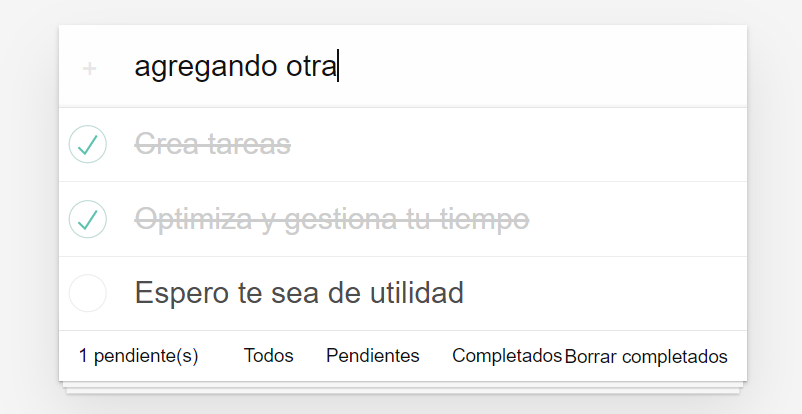
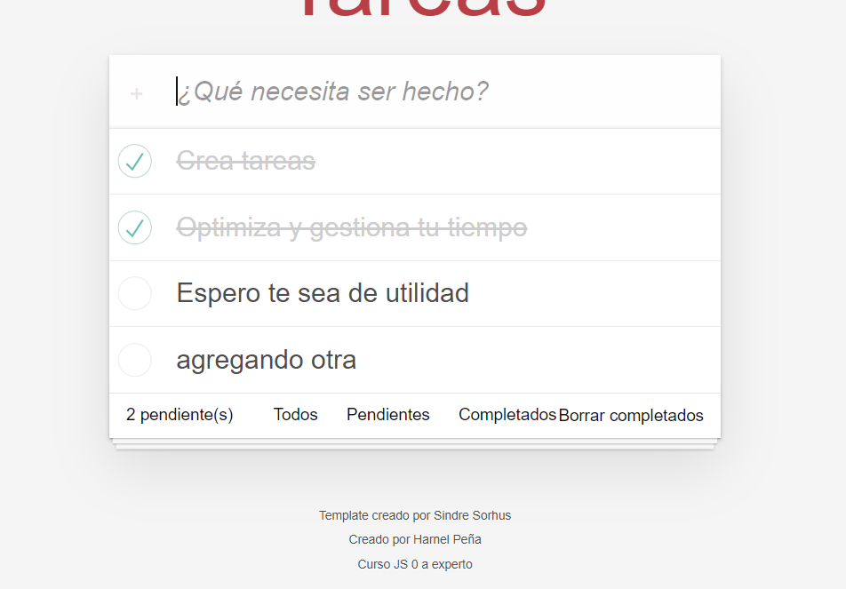
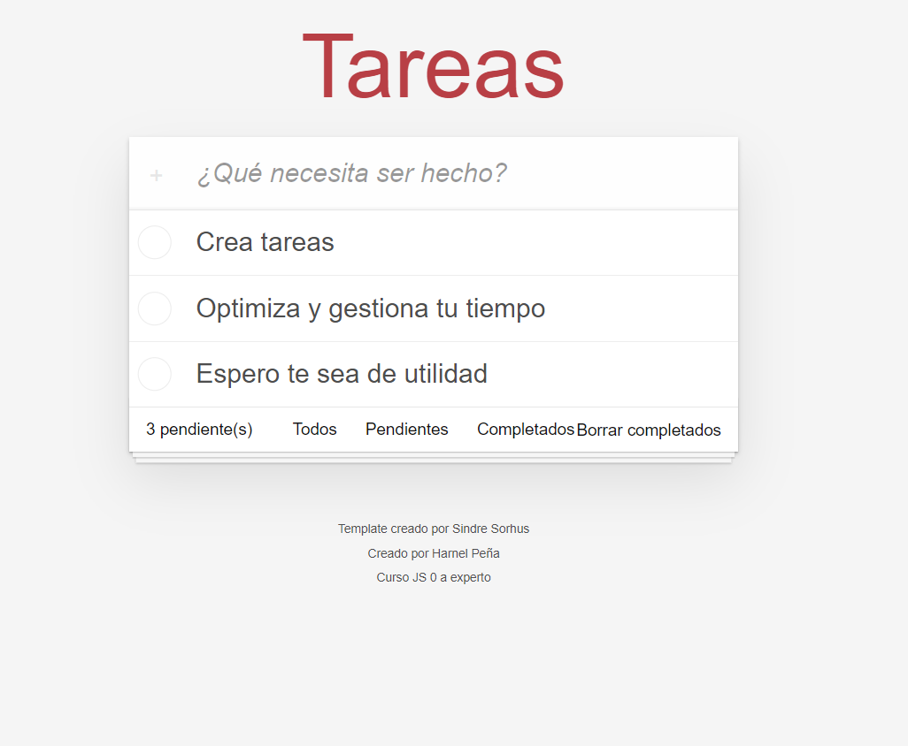
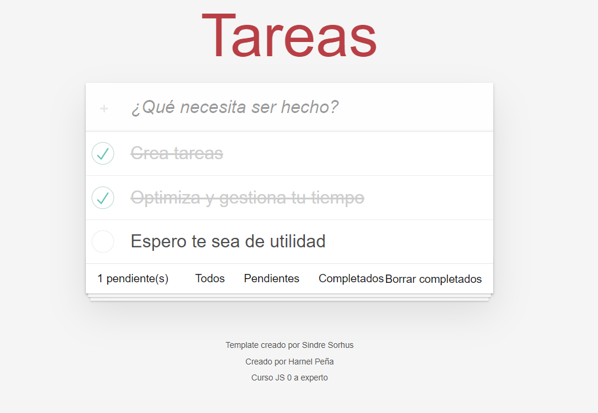

# js-vite-todo app

1. Clonar repositorio
2. Ejecutar ```npm install```
3. Ejecutar ```npm run dev``` para correr en desarrollo

[Link del sitio para test](https://main--luxury-starburst-e7e68c.netlify.app/)

## images

agregando tareas



listado de tareas


marcar tareas realizadas

